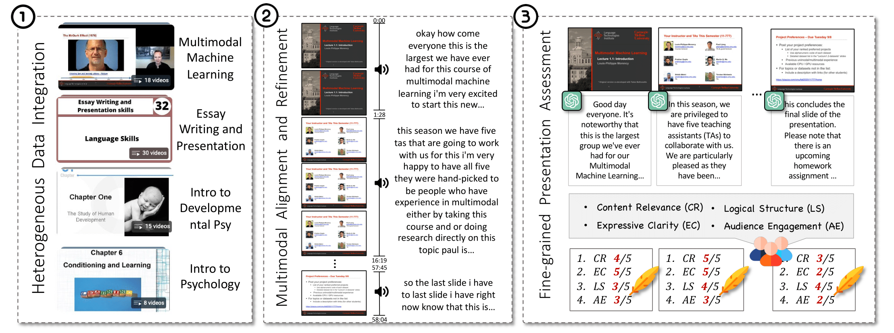
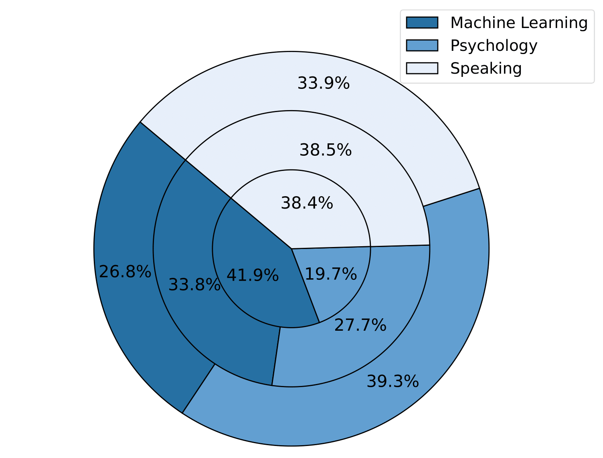
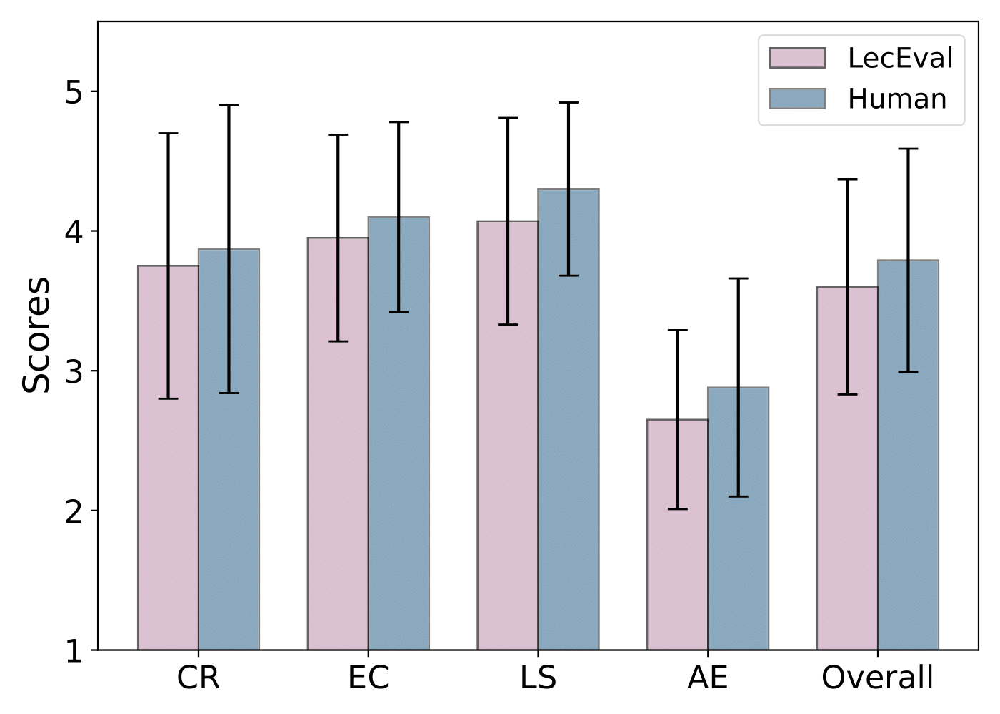

# 🎓 LecEval: An Automated Metric for Multimodal Knowledge Acquisition in Multimedia Learning

<div align="center">

   [**📄 Paper**]() | [**🗂️ Dataset**](#dataset) | [**🤖 Model**](#model) | [**📊 Evaluation**](#evaluation) | [**🚀 News**](#news)

</div>

LecEval is an automated metric designed specifically for evaluating multimodal knowledge acquisition in slide-based learning. Drawing inspiration from **Mayer’s Cognitive Theory of Multimedia Learning**,  which emphasizes the importance of aligning verbal and visual information in educational contexts, we establish four critical scoring rubrics: *Content Relevance (CR)*, *Expressive Clarity (EC)*, *Logical Structure (LS)*, and *Audience Engagement (AE)*, to assess the effectiveness of slide presentations.

<a name="dataset"></a>

## 🗂️ Dataset

### Problem Formulation

Consider a presentation slide $S$ containing multimodal content, such as text, images, and diagrams. In slide-based learning, the goal of knowledge acquisition can be formulated as understanding a generated explanatory textual sequence $T$ that integrates external knowledge, $\mathcal{K}=\Phi(S)$. Formally, we define:

$$
T_{S} = \xi(S,\mathcal{K})=\xi(S,\Phi(S)),
$$

where $\xi(\cdot)$ represents the function that produces coherent explanatory text based on the slide content, and $\Phi(\cdot)$ denotes the auxiliary knowledge.
To evaluate the quality of the generated textual explanations, we define a metric:

$$
\mathcal{A}=\mathcal{A}(S,T_S)=\mathcal{A}(S,\xi(S,\mathcal{K})),
$$

which assesses the knowledge acquisition in slide presentations in both content alignment and knowledge enhancement.

### Data Construction

The general data construction framework of our dataset:


**1. Heterogeneous Data Integration**.
We collect and process online lecture videos, extracting both slides and speech transcripts.

**2. Multimodal Alignment and Refinement**. We manually align transcriptions with their corresponding slides and refine the raw transcriptions leveraging GPT-4, enhancing clarity and coherence while perceiving the speaker's original intent, in order to facilitate the annotation process.

**3. Fine-grained Presentation Assessment.**. We engage experienced human annotators to evaluate the slide presentations across our predefined rubrics: *content relevance*, *expressive clarity*, *logical structure*, and *audience engagement*.

### Data Analysis

Our curated dataset includes a collection of 56 lectures, encompassing a total of 2,097 samples. Each sample includes a slide image paired with a refined caption and ratings assigned by annotators based on our established evaluation rubrics.

```json
{
  "id": "ml-1_10_slide_000", 
  "slide": "/data/images/ml-1/10/slide_000.png",
  "speech": "Welcome, everyone, to Lecture 5.2 on Alignment and Representation.",
  "rate": {
    "content_relevance": [5, 5, 5],
    "expressive_clarity": [5, 5, 5],
    "logical_structure": [5, 5, 5],
    "audience_engagement": [1, 1, 1]
  }
}
```

The statistics of our dataset, which offers a detailed breakdown across several key topics：

<p align="center">
  
</p>

The outer ring represents the *total number of lecture videos*, the middle ring shows the *total hours of these videos*, and the inner ring indicates the *total number of slides presented* in the lecture.

<a name="model"></a>

## 🤖 Model

We select MiniCPM-Llama3-V2.5, with $8B$ parameters, as our backbone model. We employ supervised fine-tuning (SFT) using our curated dataset.

You can access our model and scripts in our [Hugging Face repository]().

The comparison of average scores between LecEval and human evaluation:

<p align="center">
  
</p>
LecEval consistently assigns higher scores to explanations that receive high ratings from human evaluators, highly aligned with human judgment.

<a name="evaluation"></a>

## 📊 Evaluation

We conduct extensive experiments to evaluate the effectiveness of our proposed metric. We compare these correlations between the automated metrics and the human evaluation average, which serves as our gold standard.

**1. Reference-based Metrics**: Comparing a manually prepared slide presentation with a machine-generated version.

**2. Prompt-based LLM Evaluators**: Leveraging hand-crafted prompt templates to guide models in rating slide and its presentation

Spearman ($\rho$) correlations between existing top-performing automated metrics and human evaluation:

<table style="width: 90%; margin: 0 auto;">
  <thead>
    <tr>
      <th><strong>Metrics</strong></th>
      <th style="text-align:center"><strong>Content Relevance</strong></th>
      <th style="text-align:center"><strong>Expressive Clarity</strong></th>
      <th style="text-align:center"><strong>Logical Structure</strong></th>
      <th style="text-align:center"><strong>Audience Engagement</strong></th>
      <th style="text-align:center"><strong>Overall</strong></th>
    </tr>
  </thead>
  <tbody>
    <tr>
      <td><strong>BLEU-4</strong></td>
      <td style="text-align:center">0.12</td>
      <td style="text-align:center">0.10</td>
      <td style="text-align:center">0.11</td>
      <td style="text-align:center">0.18</td>
      <td style="text-align:center">0.13</td>
    </tr>
    <tr>
      <td><strong>ROUGE-L</strong></td>
      <td style="text-align:center">0.24</td>
      <td style="text-align:center">0.29</td>
      <td style="text-align:center">0.15</td>
      <td style="text-align:center">0.07</td>
      <td style="text-align:center">0.19</td>
    </tr>
    <tr>
      <td><strong>GPT-4V</strong></td>
      <td style="text-align:center">0.29</td>
      <td style="text-align:center">0.20</td>
      <td style="text-align:center">0.27</td>
      <td style="text-align:center">0.32</td>
      <td style="text-align:center">0.27</td>
    </tr>
    <tr>
      <td><strong>G-Eval</strong></td>
      <td style="text-align:center">0.26</td>
      <td style="text-align:center">-0.05</td>
      <td style="text-align:center">0.13</td>
      <td style="text-align:center">0.04</td>
      <td style="text-align:center">0.09</td>
    </tr>
    <tr>
      <td><strong>LecEval</strong></td>
      <td style="text-align:center"><strong>0.65</strong></td>
      <td style="text-align:center"><strong>0.84</strong></td>
      <td style="text-align:center"><strong>0.80</strong></td>
      <td style="text-align:center"><strong>0.79</strong></td>
      <td style="text-align:center"><strong>0.77</strong></td>
    </tr>
  </tbody>
</table>

<a name="news"></a>
## 🚀 News

- [2025-02] Our paper is submitted to SIGIR resource track !!
