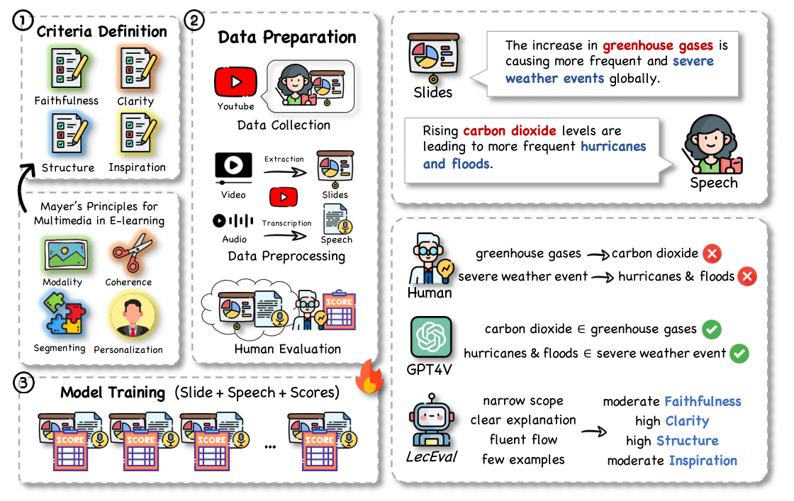

# LecEval
This is an official repository for a LecEval, a multimodal framework aimed at lecture assessment across predefined criteria: **Faithfulness**, **Clarity**, **Structure**, and **Inspiration**. 

## Overview
The general framework of LecEval:

(1) **Evaluation Criteria Definition**: We establish a set of criteria that capture the essential qualities of a lecture, serving as the foundation for our assessment process. 

(2) **Data Preparation**: We collect data from online courses, extracting both presentation slides and the accompanying speech. We engage experts to evaluate the lectures across predefined criteria, with each criterion rated on a scale from 1 to 5. 

(3) **Model Training**: We utilize the expert-rated scores to train a model to assess lectures in relation to their slides.



## Dataset Structure
The dataset consists of slides extracted from various online courses on YouTube, each paired with speech transcripts and human ratings ranging from 1 to 5. The data format is as follows:

```json
{
  "id": "ml-1_10_slide_000", 
  "slide": "/data/images/ml-1/10/slide_000.png",
  "speech": "Welcome, everyone, to Lecture 5.2 on Alignment and Representation.",
  "rate": {
    "faithfulness": [5, 5, 5],
    "clarity": [5, 5, 5],
    "structure": [5, 5, 5],
    "inspiration": [1, 1, 1]
  },
  "prompt": [
    {
      "role": "user",
      "content": "Instructions:\n\nYou are provided with a segment of a lecture slide and its corresponding transcript. Evaluate the transcript based on the following criteria:\n\n1. Faithfulness to the Slide: How accurately does the transcript represent the information on the provided PowerPoint slide?\n2. Clarity of Language: How clear and understandable is the language used in the transcript?\n3. Structure and Organization: How well is the transcript structured and organized?\n4. Inspirational Value: How inspiring and engaging is the transcript?\n\nRate each criterion on a scale from 1 to 5, where 1 is the lowest and 5 is the highest. Provide your ratings in the format: Faithfulness, Clarity, Structure, Inspirational (e.g., 3, 4, 2, 5).\n\nTranscript:\nWelcome, everyone, to Lecture 5.2 on Alignment and Representation.\n\nOutput:\n"
    },
    {
      "role": "assistant",
      "content": "5, 5, 5, 1"
    }
  ]
}
```

